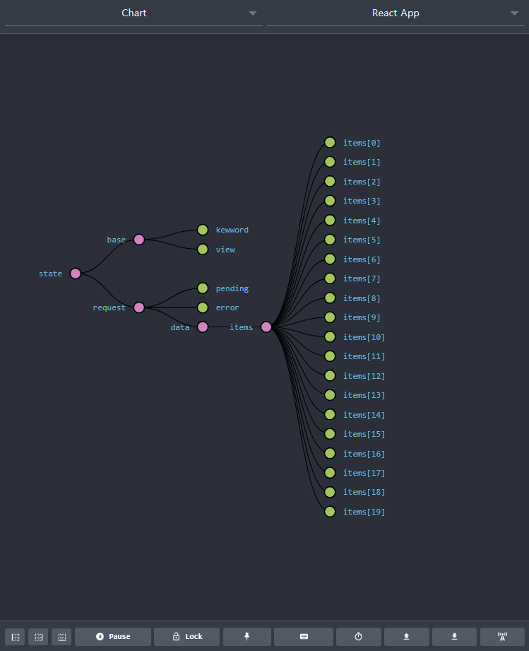
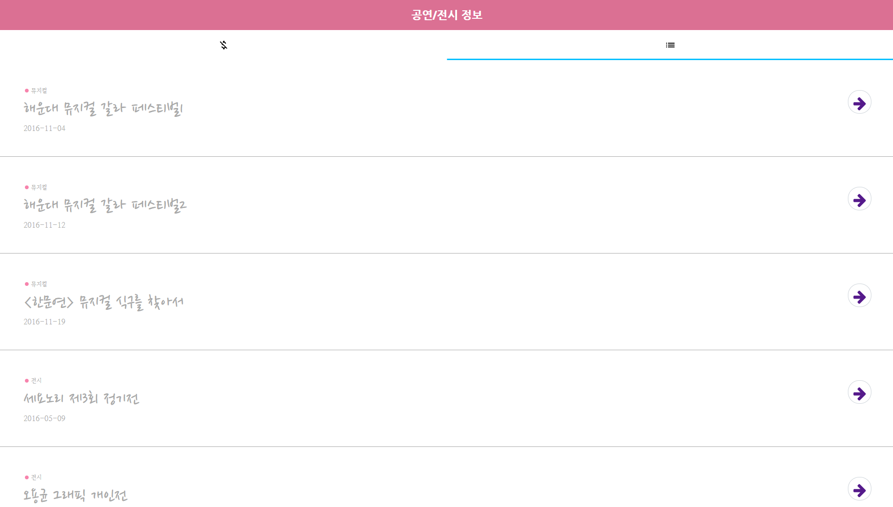
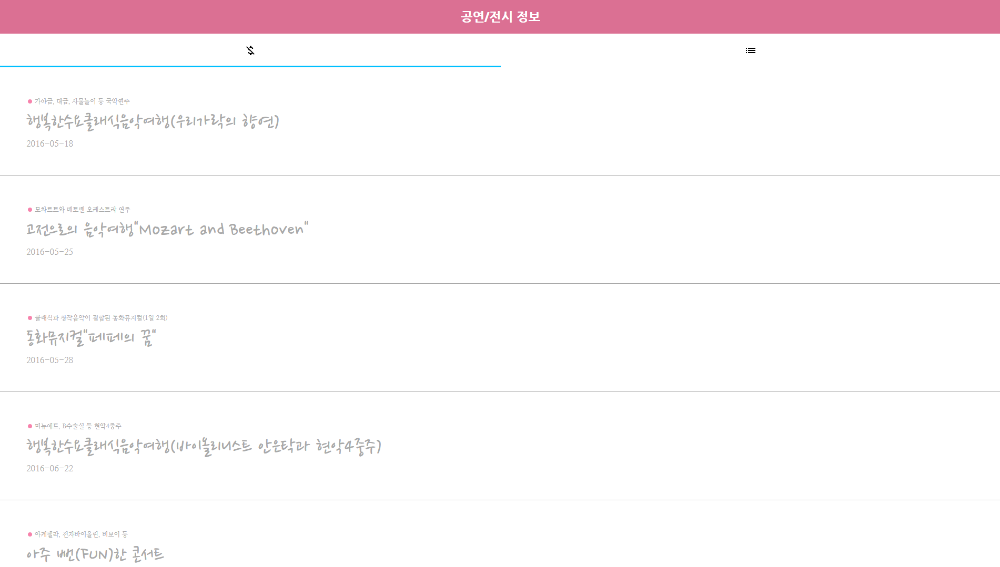
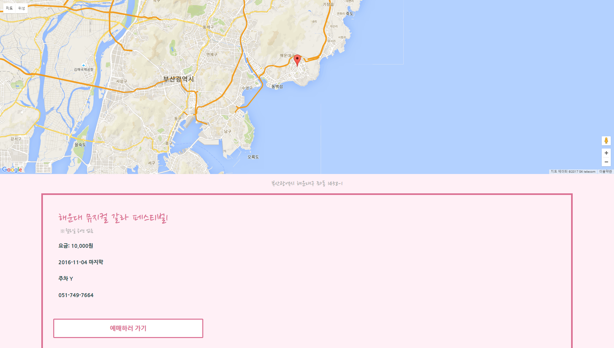

부산 전시/문화 행사 안내 서비스
========

>React.js/Redux 부산 전시/문화 행사 안내 서비스

Demo
===


> 시작 페이지



> 데이터 요청 후 Redux Devtools로 본 state



```javascript
const itemList = items.map((item, index)=><div key={index}><ListItem item={item} index={index}/></div>);
```



> 무료 공연만 필터링

```javascript
const freeList = items.filter(item => item.fee === '무료')
```



> 상세보기 페이지와 구글 맵스

> 아쉽게도 데이터가 잘못된 모양인지 사상 쪽 어느 부분과 해운대 밖에 위치가 뜨지 않는다.

후기
===

* Redux 
---

>이 프로그램을 마무리하기 전에 react native 프로그램을 만들면서 단순히 state만으로 앱을 만들 수 없다는 생각이 들었다. 앱의 규모가 너무 작아서 프로젝트라는 표현보다는 프로그램이라는 표현이 더 잘 어울리는 것 같다. react는 데이터의 흐름이 양방향이 아니라 단방향이기 때문이다. 원하는 동작을 하게 하기 위해서 데이터를 반대 방향으로 흘러보내야 할때가 있다. 하지만 구조상 굉장히 복잡하고 스파게티 코드가 될 가능성이 높다. 구조가 복잡해지는걸 원하지 않아서 내가 구현하고 싶었는 기능을 포기해야만 했다. redux는 코드로 구현하기는 복잡하지만 구글에 있는 구조도 같은 걸 봤을때 굉장이 단순하고 또, react와 찰떡 궁합으로 유명하기 때문에 redux를 이용해서 프로그램을 구현했다.

* Data

> 처음 프로그램을 구상할 때 공공 데이터에서 데이터를 받아서 화면에 뿌리고 싶었지만, node.js의 언어 특성상 굉장히 어려움이 많았다. 공공 데이터 포탈에서 안내해주는 데이터를 받는 코드로 데이터를 받았을 때, 콜백함수 밖에서는 그 데이터에 접근 할 수 있는 방법이 없기 때문에 react 하위 컴포넌트로 데이터를 흘러보낼 방법이 없어서 굉장히 난감했다. 도저히 방법을 찾을 수가 없어서 몇일 동안 그 부분에 대해서만 고민했던 것 같다. 스텍 오버 플로우를 뒤져봐도 거기에 대한 질문은 있었지만 답변에 깔끔한 코드가 없었던것 같다. 답변자도 이런식으로 밖에 답해줄 수 없어서 아쉽다고 하고 있었다. 그래서 데이터를 받는 코드 자체를 redux 코드안에 삽입해서 문제를 해결했다. 데이터를 받자마자 데이터가 redux state로 주입이 되는 식이다. 깃허브 코드에 그대로 나와 있다. 이런식으로 문제를 해결하다보니 또 다른 문제가 생기고 이런식이었다. 

* Thunk
> 구조가 이런식으로 되다보니 단 한번 데이터를 받는 구조임에도 불구하고 redux-thunk를 이용해서 비동기적으로 받을 수 밖에 없었다. 비동기에 관해서는 thunk 말고도 더 간단하고 깔끔하게 비동기 코드를 짤 수 있는 라이브러리들이 많지만 이 프로그램에서는 워낙 기능이 단순해서 조금 복잡해도 제일 유명한 redux-thunk를 이용했다. 특히 해외 프로그래머들에게는 redux-saga가 유명한것 같다. saga에 대해서 조사를 했던 기간이 있었는데, 자료가 방대해서 자료를 정리하는게 힘들었고, 코드를 그대로 따라서 공부해 볼 수 있는 자료가 유튜브에 있는 블로거 한 사람 자료 밖에 없어서 saga는 이용하지 않았다. 하지만 thunk 대신 saga를 썼다면 코드를 10분의 1로 줄일 수 있었을 것이라고 생각한다.

* Xml/Json
> thunk를 이용해서 데이터를 받은 다음에는 데이터 구조 문제였다. 공공데이터 포탈의 대부분의 데이터는 xml 형식으로 되어있었다. 간혹가다가 json 형식으로 되있는 데이터도 있었는데, 지방쪽 데이터는 다 xml로 되었었던것 같다. 하지만 지방 쪽의 최신 데이터는 json 형식으로 되있고 서울 데이터는 거의가 json형식으로 되있는걸로 봐서는 앞으로의 데이터는 다 json으로 나올 것 같다. xml 을 이용해서 프로그램을 짜는게 굉장히 불편해서 xml로 받은 데이터를 json 형식으로 바꾸려고 npm 패키지를 이용했지만 thunk로 받은 데이터가 프로미스 객체여서 request 패키지로 받은 데이터를 json으로 바꾸는 것은 가능했지만 프로미스 객체를 json 으로 바꾸는것은 오류가 있었다. 이렇게 데이터를 받는 구조를 짜는것이나 데이터 형식으로 다루는데만 거의 개발기간의 80퍼센트가 들어갔던 것 같다.

* Immutable.js
> spread operator를 사용하고 싶지 않아서 썼는데 처음 배울때는 어떻게 쓰는지 굉장히 헷갈렸다.

* react-router-dom
> 라우팅을 위해서 react-router-dom를 사용했는데 링크가 걸리는 부분이 스타일링 되지 않았다.나는 프론트엔드 개발자 지망생이고, 개발할 때 예쁘게 꾸미는걸 굉장히 좋아하는데 이런 눈에 걸리는 부분이 굉장히 아쉽다. 개발을 끝내고 보니 제일 아쉬웠던 점으로 남는다.

Main Technology Stack
===
* React.js
* react-router-dom
* Redux
* Redux-thunk
* Redux-Actions
* Styled-Component
* Immutable.js
* react-google-maps
* open-color
* Redux Devtools

Feature
===
> 크로스 도메인 문제가 발생하면 크롬 확장 프로그램을 이용해주세요.

Source Code
===
> [https://github.com/tjdgns8047/Board-Portfolio](https://github.com/tjdgns8047/Ajax-Portfolio)


Depolyment
===
Installation
---
1. Dowload
```
$ git clone https://github.com/tjdgns8047/Ajax-Portfolio.git
```
2. Change folder
```
$ cd Ajax-Portfolio
```
2. Set up
```
$ yarn
```
3. execute
```
$ yarn start
```


